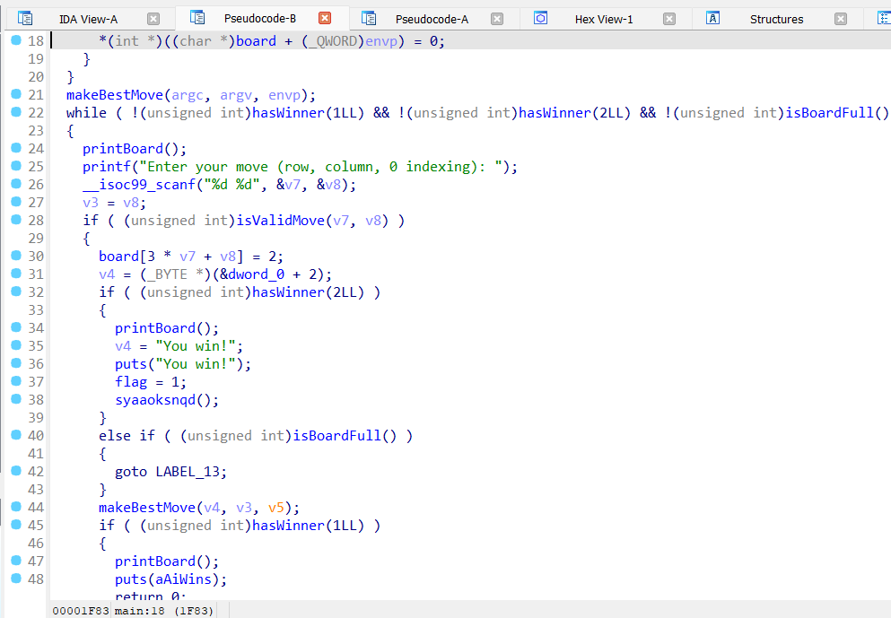
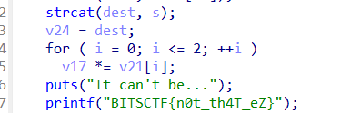

# baby-rev

Category: rev

Solves: 468

### Description

> anita max wyinn

***

### Solution

We are provided with a file, `baby-rev`.\
Opened the given file in ghidra.\
Found the checking function `myfunc` inside which each character of flag was being checked.


assembled the flag manually from there to solve.

***

### Flag  - `BITSCTF{w3lc0me_t0_r3v}`

***


# Maxxing

Open the given minimax binary in a decompiler. From there in main you can see the specific function being called for the win




In this `syaaoksnqd` function at the end it just prints the red herring flag. But we can also see a hex being created. It is being made and copied into `dest` in the order provided and this gives 

`0x7008761D1E0CC30311AA0A04BD5D44A9F36233921865AE9DD4D471F06298B2FD94F`

If you look more in the function you can see two extra numbers here, an array of size of 3 and the same array of size 3 being multipled at the end.




`v22 : 0x133, v23 : 0x7E4E0C1`

So we can assume that there were supposedely three numbers that got multiplied in this win funciton. we have specifically three number.

```python
from Crypto.Util.number import long_to_bytes
a = 0x7008761D1E0CC30311AA0A04BD5D44A9F36233921865AE9DD4D471F06298B2FD94F
b = 0x133
c = 0x7E4E0C1

print(long_to_bytes(a * b * c))
```

`b'BITSCTF{w3_n33d_t0_st4rT_l0ok5m4Xx1nG}'`


# Touch Grass
The question provides an apk that counts the number of steps using accelerometer. This has a couple of solutions. 
## Solution 1:
You can just walk.
## Solution 2:
You can shake the phone. This changes the acceleration constantly and it is counted as steps.
